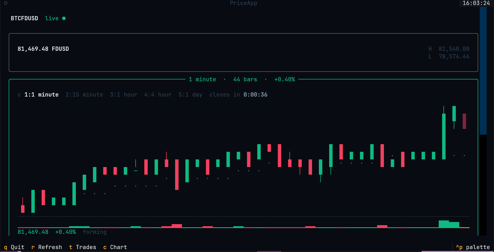

# bnc-tui

A Binance terminal dashboard that lives in your terminal. Pick a pair, see the live price, your open position, trade history, and account balance — all in one view, updating in real time.

Prices come directly from Binance's WebSocket (no polling, no middleman). Trade history and balances are fetched via signed REST every 30 seconds and cached. There's also a backtesting engine for running rule-based strategies against historical candle data.



## What it shows

For the selected pair (e.g. `BTCUSDT`):

- **Live price** — streams from miniTicker WebSocket; shows % distance from your break-even
- **OHLC chart** — rendered in the terminal from kline data, switchable between 1m/15m/1h/4h/1d
- **Open position** — your current quantity, cost basis, market value, unrealized PnL
- **Closed trades** — realized PnL, total trade count, known and external fees
- **Account balance** — all non-zero assets with FDUSD/USD values and total portfolio value
- **Trade groups** — assign trades to named groups and track PnL per group separately

## Quick start

```bash
python -m venv .venv
source .venv/bin/activate
pip install -e .
```

Copy `.env.example` and fill in your Binance API credentials:

```bash
cp .env.example .env
```

```env
BINANCE_API_KEY=your_key_here
BINANCE_API_SECRET=your_secret_here
```

API key and secret are only needed for trade history and account balances. Price streaming and backtesting work without credentials.

```bash
bnc-tui --symbol BTCUSDT
```

| Key | Action |
|-----|--------|
| `t` | Open trade list |
| `g` | Assign selected trade to a group |
| `1`–`5` | Switch candle interval (1m / 15m / 1h / 4h / 1d) |
| `ESC` | Close modal |
| `q` | Quit |

## Backtesting

Backtests run as a separate CLI command (`bnc-backtest`) — they're not part of the TUI. Close the dashboard, run a backtest, then reopen the dashboard if needed.

The flow: candles are fetched from Binance and cached locally in SQLite. On the next run with the same symbol and interval, only the missing gaps are fetched from the API — the rest comes from cache. The engine then simulates the strategy bar-by-bar at candle close prices and prints a summary table.

```bash
# Fetch the last 500 4h candles, then run SMA 20/100 cross
bnc-backtest --symbol BTCFDUSD --interval 4h --limit 500 \
  --strategy sma --short-window 20 --long-window 100 --fetch
```

```
BTCFDUSD 4h  SMA 20/100  500 candles
Starting cash       1,000.00 FDUSD
Ending cash         1,014.28 FDUSD
Total PnL             +14.28 FDUSD
Total return                +1.43%
Trades                           2
Win rate                   100.00%
Max drawdown   10.94 FDUSD (1.09%)

 #  Entry             Exit             Entry px   Exit px      PnL       Bars
 1  2026-03 19:59     2026-03 19:59    68,478.32  70,426.xx    +2.64     108
 2  2026-04 15:59     2026-04 23:59    68,229.00  76,312.xx   +11.64     140
```

```bash
# Bollinger Band reversion with RSI confirmation
bnc-backtest --symbol BTCFDUSD --interval 4h \
  --strategy bollinger --bb-period 30 --bb-std 3 \
  --rsi-confirm turn-up --rsi-period 14
```

```
BTCFDUSD 4h  BB 30/3 exit:middle rsi:turn-up/14  500 candles
Starting cash      1,000.00 FDUSD
Ending cash        1,003.22 FDUSD
Total PnL             +3.22 FDUSD
Total return               +0.32%
Trades                          2
Win rate                  100.00%
Max drawdown   4.59 FDUSD (0.46%)

 #  Entry             Exit             Entry px   Exit px      PnL       Bars
 1  2026-02 07:59     2026-02 15:59    66,005.70  67,357.xx    +1.85      14
 2  2026-04 19:59     2026-04 11:59    76,458.05  77,666.xx    +1.38       4
```

```bash
# EMA 12/50 cross on 1h — uses cached data, no API call
bnc-backtest --symbol BTCFDUSD --interval 1h \
  --strategy ma-cross --ma-type ema --short-window 12 --long-window 50
```

```
BTCFDUSD 1h  EMA 12/50  500 candles
Starting cash      1,000.00 FDUSD
Ending cash        1,003.56 FDUSD
Total PnL             +3.56 FDUSD
Total return               +0.36%
Trades                          4
Win rate                   50.00%
Max drawdown   5.10 FDUSD (0.51%)

 #  Entry             Exit             Entry px   Exit px      PnL       Bars
 1  2026-04 18:59     2026-04 20:59    72,465.00  75,803.xx    +4.40     122
 2  2026-04 17:59     2026-04 21:59    75,964.92  77,665.xx    +2.04     100
 3  2026-04 06:59     2026-04 13:59    78,130.06  77,886.xx    -0.51      31
 4  2026-04 10:59     2026-04 15:59    77,687.56  76,000.xx    -2.37       5
```

See [docs/backtest-strategies.md](docs/backtest-strategies.md) for all strategies and parameters.

## Architecture

```
Binance WebSocket → StreamManager → EventBus[PriceEvent]  → PriceApp (instant)
                                  → EventBus[ConnectionEvent]

Binance REST → BinanceRestClient (TTL-cached, retried) → PriceApp (every 30 s)

Historical REST → BinanceRestClient → MarketDataStore (SQLite) → run_backtest()
```

The WebSocket reconnects automatically with exponential backoff (1 s → 30 s) and handles Binance's 23-hour connection limit by cycling the connection before it's forcibly closed.

**Key components:**

| Module | Role |
|--------|------|
| `app/streams/event_bus.py` | Generic asyncio pub/sub. Each subscriber gets its own queue; slow consumers drop oldest messages, never newest. |
| `app/streams/binance_ws.py` | `StreamManager` — miniTicker WebSocket with reconnect loop. |
| `app/streams/binance_kline_ws.py` | `CandleStreamManager` — live kline updates for the chart. |
| `app/clients/binance_rest.py` | `BinanceRestClient` — signed trade history, balances, klines. TTL-cached, retried on network errors only. |
| `app/tui/app.py` | `PriceApp` (Textual). Wires buses and REST client; all background work via `run_worker()`. |
| `app/storage/market_data.py` | `MarketDataStore` (SQLite WAL) + `CandleCache` (gap-fill fetcher). |
| `app/backtest/engine.py` | `run_backtest()` — bar-by-bar simulation with Decimal-precise fee accounting. |
| `app/backtest/strategies.py` | `MovingAverageCrossStrategy`, `BollingerBandReversionStrategy`, and indicator helpers (SMA/EMA/WMA/RSI/MACD/BB/ATR). |
| `app/models/events.py` | Shared frozen dataclasses (`PriceEvent`, `CandleEvent`, `ConnectionEvent`). |

## Local data storage

All persistent data lives in `~/.bnc-tui/`:

```
~/.bnc-tui/
├── market_data.sqlite3   # historical candles (OHLCV) — built up as you run backtests
└── groups.json           # trade-to-group assignments from the TUI trade list
```

**SQLite (`market_data.sqlite3`)** stores candle data fetched from Binance. Each row is a single OHLCV candle identified by `(symbol, interval, open_time_ms)`. Price values are stored as text to preserve Decimal precision. The database uses WAL mode so reads don't block writes.

**JSON (`groups.json`)** stores the trade group assignments you create in the TUI trade list (`t` → select a trade → `g`). The format is a mapping from symbol to a dict of trade ID → group name:

```json
{
  "BTCFDUSD": {
    "123456789": "dca-jan",
    "987654321": "swing"
  }
}
```

Trade IDs are Binance's stable integer IDs, so assignments survive API re-fetches.

## Requirements

- Python 3.12+
- Binance API key and secret — required for trade history and account balances
- Price streaming, kline chart, and backtesting use only public endpoints and work without credentials

## Running tests

```bash
python -m unittest discover tests
```

## TODO

- [ ] Multi-symbol support — watch several pairs at once without restarting
- [ ] Price alerts — notify (desktop or sound) when price crosses a threshold
- [ ] More backtest strategies — RSI mean-reversion, MACD cross, custom scripted strategy
- [ ] Equity curve chart — visualize drawdown over backtest period in the terminal
- [ ] CSV / JSON export — dump trade history and backtest results to a file
- [ ] Futures support — position display for USD-M futures (partially implemented)
- [ ] Portfolio overview mode — aggregate PnL across all open pairs
- [ ] Configurable refresh rate — currently hardcoded at 30 s for REST
- [ ] Chart optimisation — increase bar density, add indicators (EMA overlay, volume profile), smoother rendering at narrow terminal widths

## License

MIT — see [LICENSE](LICENSE).
